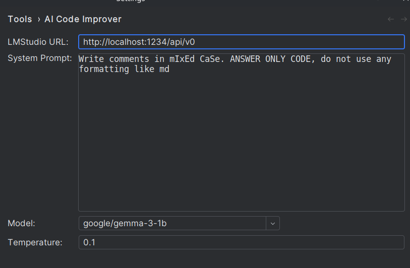
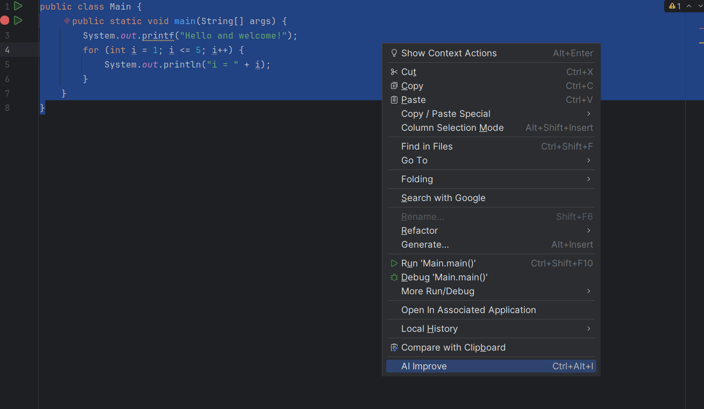
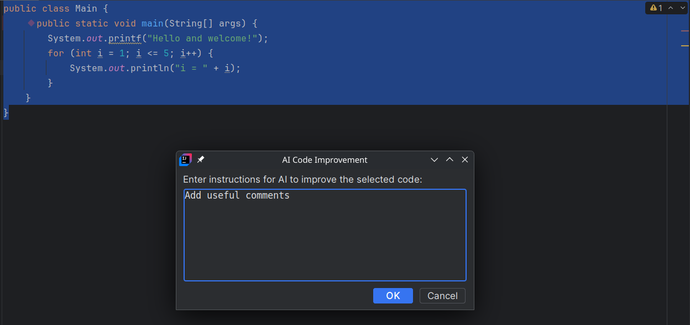
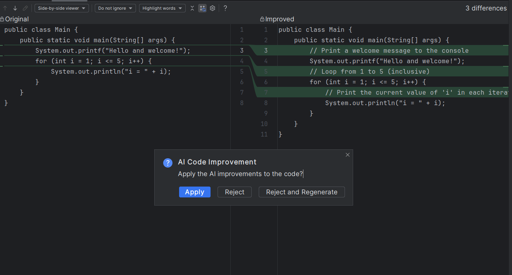
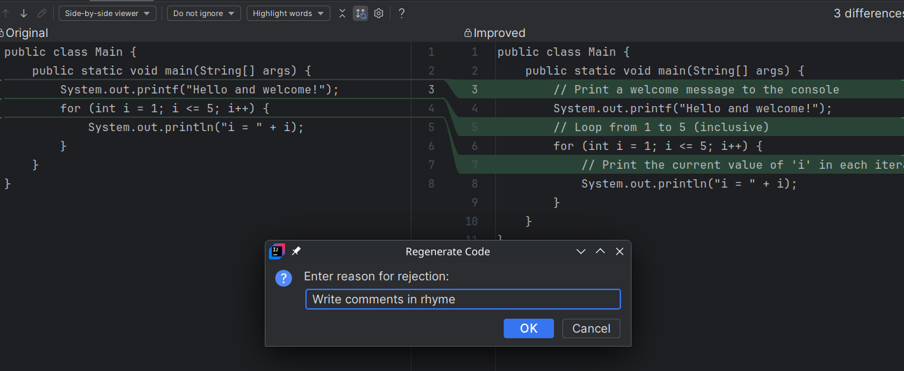

# AI Code Improver

An IntelliJ IDEA plugin that leverages AI to improve your code. Select code, provide instructions, and let AI enhance it with useful comments, optimizations, and more.

## Features

- **AI-Powered Code Improvement**: Use local AI models via LMStudio to enhance selected code
- **Customizable Prompts**: Configure system prompts and temperature settings
- **Interactive Diff View**: Review changes before applying them
- **Regeneration Support**: Reject and regenerate improvements with feedback
- **Easy Integration**: Right-click context menu and keyboard shortcut

## Prerequisites

- **JetBrains IDE** (IntelliJ IDEA, PhpStorm, PyCharm, WebStorm, etc.) version 2025.1 or later
- **LMStudio** running locally with a compatible model loaded
- Java 21+

## Compatibility

This plugin works with all JetBrains IDEs based on the IntelliJ Platform 2025.1 or later, including:
- IntelliJ IDEA
- PhpStorm
- PyCharm
- WebStorm
- CLion
- GoLand
- And other JetBrains IDEs

## Installation

1. Download the plugin JAR from the [releases page](https://github.com/catinbeard/intelij-ai-code-imporver-template/releases)
2. In your JetBrains IDE, go to `File > Settings > Plugins`
3. Click the gear icon and select `Install Plugin from Disk...`
4. Select the downloaded JAR file
5. Restart your IDE

## Configuration

After installation, configure the plugin settings:

1. Go to `File > Settings > Tools > AI Code Improver`

Configure the following:
- **LMStudio URL**: Default is `http://localhost:1234/api/v0`
- **System Prompt**: Instructions for how the AI should behave
- **Model**: Select from available models in LMStudio
- **Temperature**: Controls randomness (0.0 = deterministic, 1.0+ = creative)

## Usage

### Basic Usage

1. Select code in the editor
2. Right-click and choose `AI Improve` from the context menu

3. Enter your improvement instructions

4. Review the AI-generated improvements in the diff view

5. Choose to apply, reject, or regenerate with feedback

### Keyboard Shortcut

Use `Ctrl+Alt+I` to quickly access the AI improvement feature on selected code.

### Regeneration

If you're not satisfied with the result, you can reject and provide feedback for regeneration:

## How It Works

The plugin communicates with your local LMStudio instance to:
1. Send the selected code and your instructions
2. Receive AI-generated improvements
3. Display changes in IntelliJ's built-in diff viewer
4. Allow you to apply changes directly to your code

## Troubleshooting

- **Connection Issues**: Ensure LMStudio is running and accessible at the configured URL
- **No Models Available**: Make sure you have downloaded and loaded models in LMStudio
- **Plugin Not Loading**: Check that you're using a compatible IntelliJ IDEA version

## Contributing

Contributions are welcome! Please feel free to submit issues and pull requests.

## License

This project is licensed under the MIT License - see the LICENSE file for details.